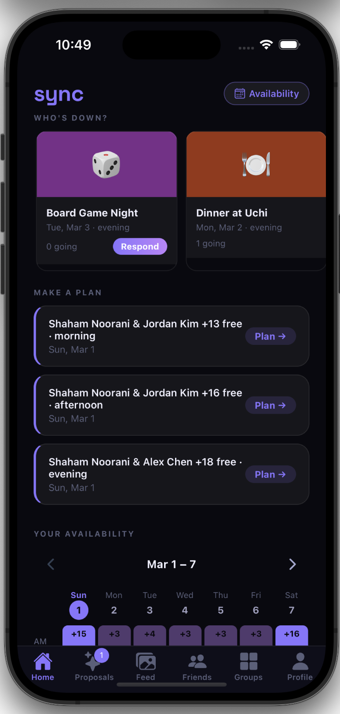
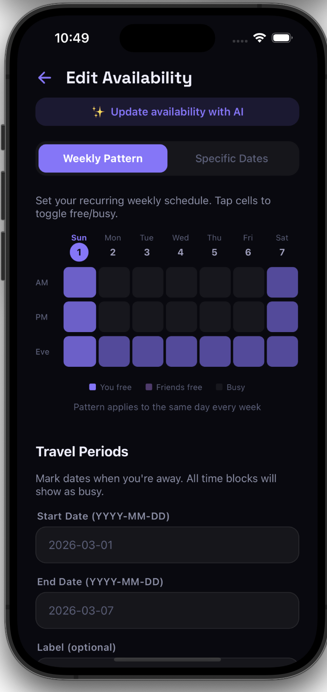
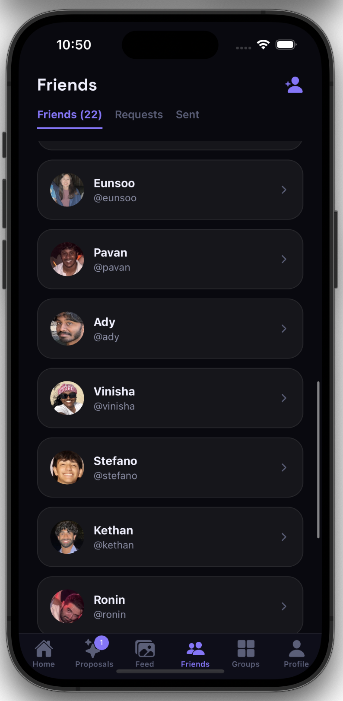
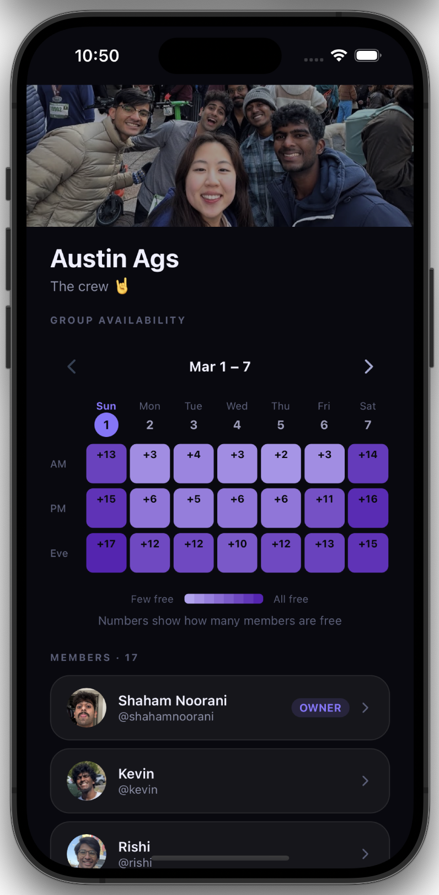
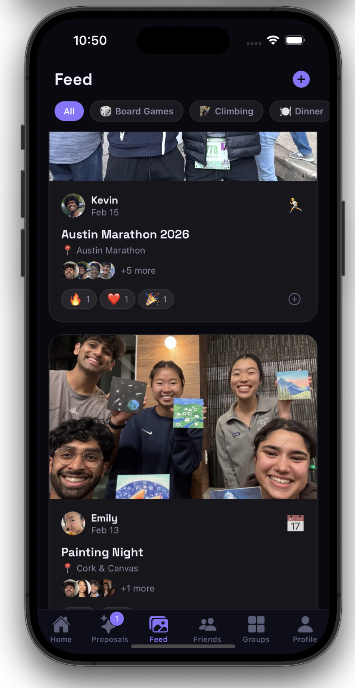
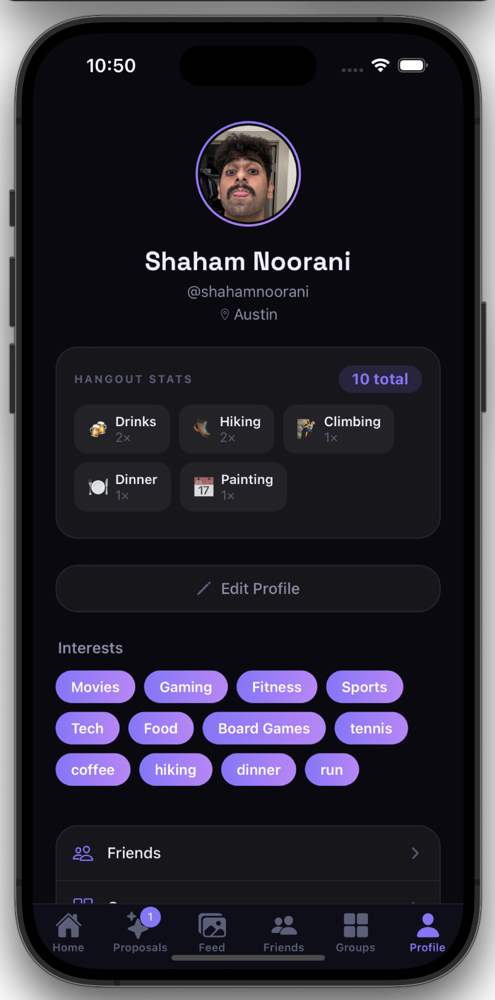

# Sync

A mobile app that makes it effortless to find time with friends — no more "we should hang out soon" threads that go nowhere.

Set your weekly availability, see when your friend group overlaps, and coordinate hangouts in a few taps.

<table>
  <tr>
    <td></td>
    <td></td>
    <td></td>
    <td></td>
    <td></td>
    <td></td>
  </tr>
</table>

## What I Built

Sync is a full-stack React Native app I designed, built, and shipped solo. The core problem: coordinating with friends is painful. Group chats turn into scheduling negotiations, people forget what they said, nothing gets planned.

Sync centralizes availability so finding a time that works is automatic.

**What's interesting about it technically:**
- Custom availability heatmap component with week-by-week navigation and skeleton loading states
- Three-layer availability model: recurring patterns, date-specific overrides, and travel blocks, all resolved by a Postgres RPC function
- Real-time friend request updates via Supabase Realtime subscriptions (no polling)
- AI-powered availability parsing, type natural language like "free weekday mornings except Tuesday" and it fills in your schedule
- Google Calendar sync via Deno Edge Functions running on a 2-hour cron
- Full test suite: 57 unit tests across components, hooks, and screens

---

## Tech Stack

| Layer | Tech |
|---|---|
| Framework | React Native (Expo SDK 54) + Expo Router v6 |
| Language | TypeScript (strict mode) |
| Styling | NativeWind v4 (Tailwind CSS for React Native) |
| Backend | Supabase (Postgres, Auth, Realtime, Storage, Edge Functions) |
| Data fetching | TanStack Query v5 |
| AI | Claude API (availability parsing) |
| Testing | Jest + React Native Testing Library · Maestro (E2E) |
| Auth | Email/password + Google OAuth (PKCE + deep link code exchange) |

---

## Features

- **Auth** — Email/password + Google OAuth with PKCE flow and deep link code exchange
- **Profiles** — Display name, bio, avatar upload, interest tags, city, hangout stats
- **Friends** — Send/accept/decline requests with real-time updates via Supabase Realtime
- **Groups** — Create groups, join via share code, member roles (owner/admin/member)
- **Availability heatmap** — Custom-built 7-day × 3-block grid visualizing free time; supports personal view and group overlap counts
- **Availability editing** — Recurring weekly patterns, specific date overrides, and travel period blocks
- **AI availability parsing** — Natural language input ("free weekday mornings except Tuesday") parsed by Claude API into structured schedule changes with a preview before applying
- **Google Calendar sync** — OAuth connect for multiple GCal accounts, per-calendar toggles, busy blocks synced automatically every 2 hours via Deno Edge Functions
- **Hangout proposals** — Create proposals with activity, date/time, location, and a guest list (friends or a group); RSVP with Going / Maybe / Can't go
- **Overlap detection** — Home screen surfaces the top 3 times your friends are collectively free, with one tap to pre-fill a proposal
- **Hangout logging** — Log completed hangouts with photos (up to 5), activity type, location, and attendees
- **Feed** — Photo feed of past hangouts with activity filters and emoji reactions (heart, fire, laugh, party, clap)
- **Dark / light mode** — Persisted theme preference via AsyncStorage
- **57 unit tests** — Components, hooks, and screens via Jest + Testing Library

---

## Architecture

```
app/
  (auth)/         # Login, signup, onboarding
  (tabs)/         # Home, Friends, Groups, Profile, Feed, Proposals
  availability/   # Availability editing flows
  gcal/           # Google Calendar connection
components/       # Shared UI (Avatar, HeatmapGrid, WeekNavigator, AiAvailabilityModal…)
hooks/            # All data fetching (TanStack Query, one hook per feature)
lib/              # Supabase client, query client, DB types, push notification helpers
providers/        # Auth, Theme, QueryClient context providers
supabase/
  migrations/     # SQL migrations
  functions/      # Deno Edge Functions: connect-gcal, sync-gcal, parse-availability
__tests__/        # Unit tests mirroring source structure
```

**A few architectural decisions worth noting:**

- No Redux or Zustand. Server state lives entirely in TanStack Query, client state in React context. Keeps things simple.
- All complex DB logic (availability resolution, overlap detection) lives in Postgres RPC functions — the app layer stays thin.
- Session storage uses AsyncStorage instead of SecureStore because Supabase's session JSON exceeds SecureStore's 2KB limit. The tradeoff is documented in `lib/supabase.ts`.
- Supabase-generated TypeScript types keep the schema and application code in sync across the whole codebase.

---

## Running Locally

```bash
npm install
npm start          # Expo dev menu (press i for iOS, a for Android)
npm run ios        # iOS simulator
npm run android    # Android emulator
npm test           # Run Jest tests
npm run test:watch # Watch mode
```

You'll need a Supabase project. Copy `.env.example` to `.env.local` and fill in your `SUPABASE_URL` and `SUPABASE_ANON_KEY`.

---

Built by [Shaham Noorani](https://github.com/shaham-noorani)
